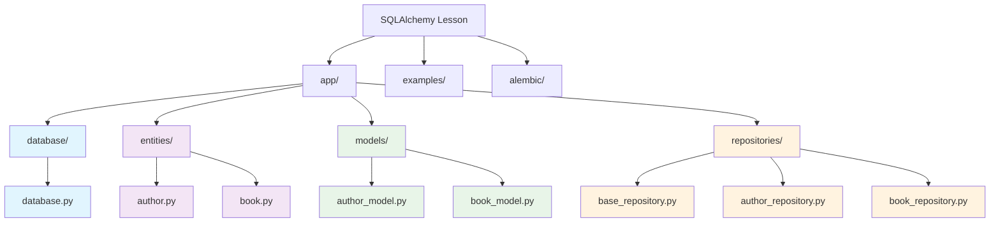
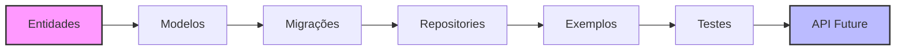

# Handout SQLAlchemy com Clean Architecture

???+ info inline end "Informações do Curso"

    **Versão**: 2025.1  
    **Duração**: 4-6 horas  
    **Nível**: Intermediário

## Sobre este Handout

Este material foi desenvolvido para ensinar **SQLAlchemy** aplicando princípios de **Clean Architecture** de forma prática e didática. O handout combina teoria e prática, guiando você na construção de um projeto completo do zero.

### Objetivos de Aprendizagem

Ao completar este handout, você será capaz de:

- [x] Configurar um projeto Python com SQLAlchemy
- [x] Aplicar princípios de Clean Architecture
- [x] Implementar o padrão Repository
- [x] Gerenciar relacionamentos entre entidades
- [x] Usar migrações com Alembic
- [x] Preparar a base para APIs REST

## Preparo Inicial

!!! tip "Pré-requisitos"

    - Python 3.8+
    - Conhecimento básico de POO
    - Git (opcional, mas recomendado)

### Estrutura do Projeto Final



## Conteúdo Presente no Handout

#### Parte 1: Fundamentos
- Configuração inicial do projeto
- Ambiente virtual e dependências
- Estrutura de pastas

#### Parte 2: Base de Dados
- Configuração SQLAlchemy
- Variáveis de ambiente
- Conexão com banco

#### Parte 3: Entidades de Domínio
- Pydantic para validação
- Conceitos de Clean Architecture
- Separação de responsabilidades

#### Parte 4: Modelos ORM
- Mapeamento objeto-relacional
- Relacionamentos many-to-many
- Configuração de tabelas

#### Parte 5: Padrão Repository
- Abstração de acesso a dados
- Repository base genérico
- Repositories específicos

#### Parte 6: Migrações
- Configuração do Alembic
- Versionamento de schema
- Gestão de mudanças

#### Parte 7: Exemplos Práticos
- CRUD completo
- Relacionamentos complexos
- Buscas avançadas

#### Parte 8: Clean Architecture
- Princípios SOLID aplicados
- Separação de camadas
- Benefícios da arquitetura

## Tecnologias Utilizadas

=== "Core"

    ```python
    SQLAlchemy==2.0.30      # ORM principal
    psycopg2-binary==2.9.9  # Driver PostgreSQL
    python-dotenv==1.0.1    # Variáveis de ambiente
    ```

=== "Validação"

    ```python
    pydantic[email]==2.7.1  # Validação e serialização
    ```

=== "Migrações"

    ```python
    alembic==1.13.1         # Controle de migrações
    ```

## Práticas

O handout inclui exercícios progressivos:

!!! example "Exercício 1: Entidade Book"
    Implementar a entidade Book com validações Pydantic

!!! example "Exercício 2: Modelo BookModel"
    Criar o modelo SQLAlchemy para a tabela books

!!! example "Exercício 3: BookRepository"
    Implementar repository com métodos específicos

!!! example "Exercício 4: Exemplo Avançado"
    Criar exemplo completo com relacionamentos

!!! example "Desafio Final: Sistema de Empréstimos"
    Implementar funcionalidade completa do zero

## 🔄 Fluxo de Desenvolvimento



## Próximos Passos

Este handout prepara você para:

- **FastAPI Integration**: Criar APIs REST robustas
- **Testing**: Implementar testes unitários e de integração  
- **Advanced Patterns**: Service Layer, DTOs, Dependency Injection
- **Production**: Deploy, monitoramento, performance

## Recursos Adicionais

### Documentação Oficial
- [SQLAlchemy 2.0](https://docs.sqlalchemy.org/en/20/)
- [Pydantic V2](https://docs.pydantic.dev/latest/)
- [Alembic](https://alembic.sqlalchemy.org/)

### Leitura Complementar
- Clean Architecture (Robert C. Martin)
- Effective Python (Brett Slatkin)  
- Architecture Patterns with Python

---

!!! success "Pronto para começar?"
    
    Vá para o [**Handout Principal**](./handout/main.md) e comece sua jornada com SQLAlchemy!
